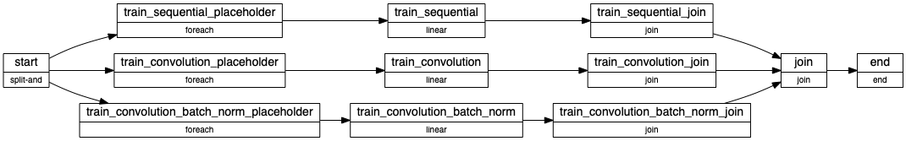

# Metaflow With Kubernetes Demo

- This repository is a demo of a plugin built on Metaflow to support Kubernetes as a compute abstraction for running machine learning workflows. 
- Works with Kubernetes Cluster and Minikube. Works with local and Service based Metadata Provider. 
- To run the `metaflow run` command within container follow the instructions given in *Using Metaflow with Kubernetes Cluster*
- The plugin supports running metaflow within container or on local machine to orchestrate workflow on Kubernetes.
- As Metaflow is currently coupled with AWS, S3 is required as a Datastore. In Future more datastores will be supported. 
- `multi_step_mnist.py` is a demo workflow which showcases how metaflow can be used with Kubernetes to parallely train multiple models with different hyperparameters and finally easily gather collated results.  
- The flow looks like the following : 

## Using Metaflow with Kubernetes Cluster
- Information on Cluster and Metaflow related services setup on Kubernetes is available [here.](https://github.com/valayDave/metaflow-on-kubernetes-docs)
    
## Setting Up Environment and Running Demo
- Install Minikube or use commands in `kops.sh` to setup a CLUSTER on AWS. For more documentation on `kops` with AWS check [here.](https://github.com/kubernetes/kops/blob/master/docs/getting_started/aws.md)
- Plugin Requires AWS KEYS to be set in environment variables. 
- Replace in AWS_ACCESS_KEY_ID,AWS_SECRET_ACCESS_KEY,AWS_SESSION_TOKEN in `setup.sh`
- Add the S3 Bucket location in `setup.sh` to METAFLOW_DATASTORE_SYSROOT_S3 environment variable. 
- Run ``sh setup.sh`` to use Minikube and run the flow with plugin repo on Kubernetes. 
- If you are not using Minikube, a Kube config is required. 

## Using The Plugin 
- Usage is very similar to `@batch` decorator. 
- on top of any `@step` add the `@kube` decorator or use `--with kube:cpu=2,memory=4000,image=python:3.7` in the CLI args. 
- To directly deploy the entire runtime into Kubernetes as a job, using the `kube-deploy run` command: 
    -  ``python multi_step_mnist.py --with kube:cpu=3.2,memory=4000,image=tensorflow/tensorflow:latest-py3 kube-deploy run --num_training_examples 1000 --dont-exit``
    - ``--dont-exit`` will follow log trail from the job. Otherwise the workflow will be deployed as a job on Kubernetes which will destroy itself once it ends. 
    - ***Directly deploy to kubernetes only works with Service based Metaprovider***
    - Good practice before directly moving to `kube-deploy` would be: 
        - Local tests : ``python multi_step_mnist.py run --num_training_examples 1000`` : With or without Conda. 
        - Dry run with ``python multi_step_mnist.py --with kube:cpu=3.2,memory=4000,image=tensorflow/tensorflow:latest-py3 run --num_training_examples 1000``
        - On successful dry run : ``python multi_step_mnist.py --with kube:cpu=3.2,memory=4000,image=tensorflow/tensorflow:latest-py3 kube-deploy run --num_training_examples 50000`` : Run Larger Dataset. 

### Running with Conda 
- To run with Conda it will need `'python-kubernetes':'10.0.1'` in the libraries argument to `@conda_base` step decorator
- Use `image=python:3.6` when running with Conda in `--with kube:`. Ideally that should be the python version used/mentioned in conda.  
- Direct deploy to kubernetes with Conda environment is supported 
    - ``python multi_step_mnist.py --with kube:cpu=3.2,memory=4000,image=python:3.6 --environment=conda kube-deploy run --num_training_examples 1000 --dont-exit``
    - Ensure to use `image=python:<conda_python_version>`

## CLI Operations Available with Kube: 
- ``python multi_step_mnist.py kube list`` : Show the currently running jobs of flow. 
- ``python multi_step_mnist.py kube kill`` : Kills all jobs on Kube. Any Metaflow Runtime accessing those jobs will be gracefully exited. 
- ``python multi_step_mnist.py kube-deploy run`` : Will run the Metaflow Runtime inside a container on kubernetes cluster. Needs metadata service to work.  
- ``python multi_step_mnist.py kube-deploy list`` : It will list any running deployment of the current flow on Kubernetes. 

## Seeing Results Post Completion 
- check [experiments_analytics.ipynb](experiments_analytics.ipynb)
- Before running notebook use %set_env in notebook to set env vars for AWS Keys. 

## Current Constraints
- Supports S3 based Datastore. Wont work without S3 as datastore. 
- Current Doesn't support GPU's. But it mostly will in future versions. 
- Needs `METAFLOW_KUBE_CONFIG_PATH` and `METAFLOW_KUBE_NAMESPACE` env vars for kubernetes config file and Namespace . Takes `~/.kube/config` and `default` as defaults
- Requires AWS Secrets in ENV Vars for Deploying PODS. That Needs fixing. 
- Supports Conda Decorators. Current ``setup.sh`` uses tensorflow/tensorflow image. 
- To use conda Add the following : 
    - ``@conda_base(python=get_python_version(),libraries={'numpy':'1.18.1','tensorflow':'1.4.0','python-kubernetes':'10.0.1'})`` above the class definition to make it work with conda.
    - TO run with conda change the line in setup.sh to following : 
        - ``.env/bin/python multi_step_mnist.py --environment=conda --with kube:cpu=2,memory=4000,image=python:3.7 run --num_training_examples 2500``
        - Please also ensure that Conda is in the PATH env variable. 

## Installing Plugin Repo
- ``pip install https://github.com/valayDave/metaflow/archive/kube_cpu_stable.zip``

## Plugin Fork Repo
https://github.com/valayDave/metaflow/tree/kube_cpu_stable
